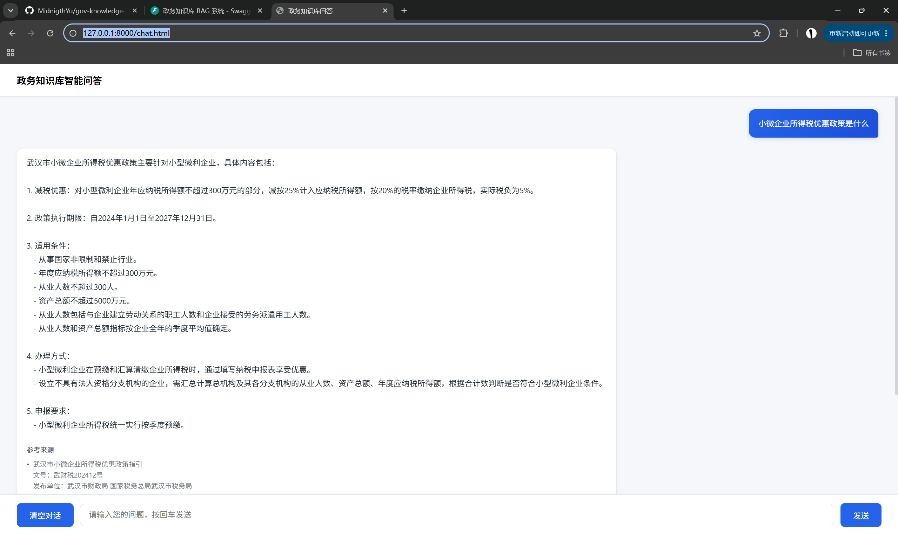
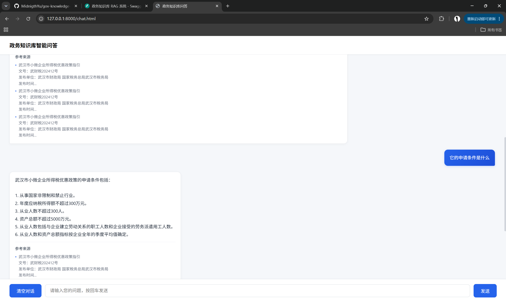
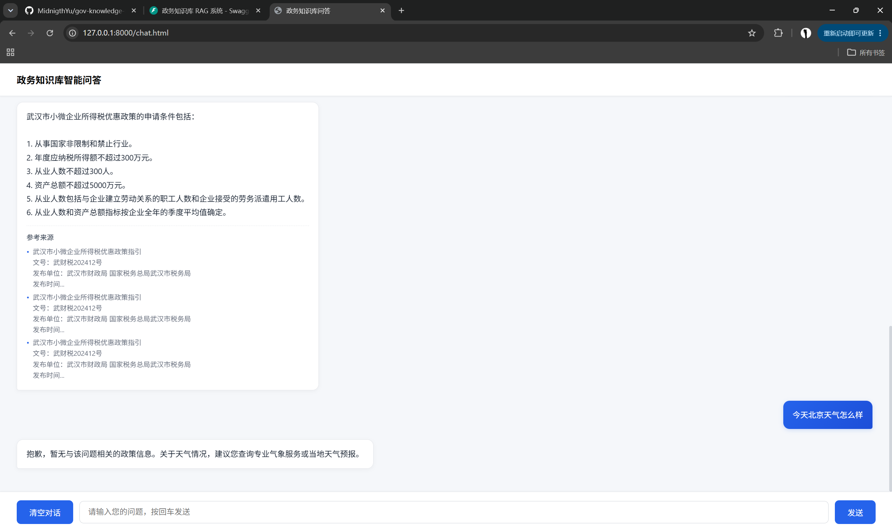
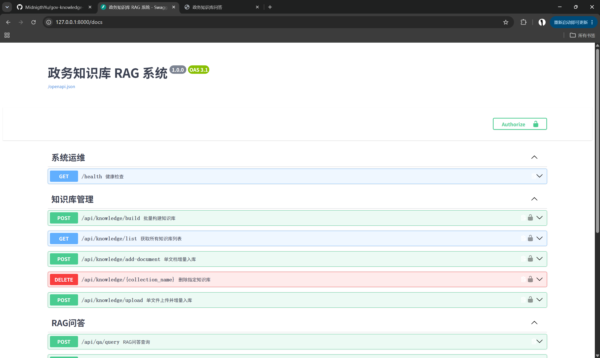

# gov-knowledge-base 政务知识库 RAG 系统
面向政务领域的智能问答系统，基于 RAG 架构实现文档解析、向量检索与大模型问答，从零搭建工业级 Python 后端工程。

## 技术栈
- Python 3.10+、requests、python-dotenv、chardet、FastAPI、Uvicorn、pytest
- **大模型与重排序**：智谱 AI GLM / Rerank、DeepSeek
- **向量数据库**：ChromaDB
- **工程化**：虚拟环境、统一日志、环境变量管理、分层架构、原子化提交、Docker 容器化编排

## 技术亮点
- **基于抽象基类的分层模块化设计**，低耦合易扩展，符合面向接口编程规范
- **多模型可插拔架构**，兼顾初期开发效率与长期架构灵活性
- **自定义分层异常体系**，错误不静默，排查定位清晰
- **全场景异常兜底**，保障批量任务鲁棒性
- **核心函数配套单元测试**，覆盖边界与异常场景，支持重构回归验证
- **配置启动前置校验**，遵循失败前置原则，问题早发现早处理
- **标准化接口与统一错误码体系**，全局异常统一收口，对外输出一致的交互规范
- **集合级多知识库隔离**，支持多业务场景数据独立管理
- **可插拔鉴权机制**，本地零配置、生产一键启用，适配不同部署环境
- **全链路相似度阈值可控**，全局配置+接口动态传参双重控制，低相关结果自动过滤兜底，从根源减少大模型幻觉
- **批量入库增量去重**，支持目录递归扫描、文件级MD5指纹校验、强制全量重建，知识库构建自动化
- **构建政务场景标注评测集与自动化评测脚本**，支持多组参数对照实验，以数据驱动技术选型，兼顾功能完整性与生产环境性价比
- **Docker 容器化私有化部署**，代码与数据完全分离，支持离线镜像导出交付，适配政务内网场景

## 功能演示
| 单轮政策问答 | 多轮上下文问答 |
| :---: | :---: |
|  |  |
| 零召回兜底 | 接口文档 |
| :---: | :---: |
|  |  |

## 目录结构
```
gov-knowledge-base/
├── app/                  # 后端业务核心包（分层架构）
│   ├── client/           # 大模型、嵌入、重排序客户端（抽象基类+多厂商实现）
│   ├── common/           # 通用组件：日志、异常、响应、鉴权
│   ├── config/           # 全局配置与环境变量管理
│   ├── dataset/          # 政务评测数据集
│   ├── routers/          # API 路由分层
│   ├── schemas/          # 请求/响应数据模型
│   ├── service/          # 业务服务层
│   ├── utils/            # 工具函数：文本清洗、分块、文件校验
│   ├── vector_store/     # 向量存储抽象与 ChromaDB 实现
│   ├── deps.py           # 依赖注入
│   └── main.py           # FastAPI 服务入口
├── data/
│   └── docs/             # 示例知识库文档
├── docs/
│   └── screenshots/      # 功能演示截图
├── scripts/              # 工具脚本：批量入库、调试、冒烟测试
├── tests/                # 全量单元测试
├── web/                  # 前端文件
│   ├── app.py            # Streamlit 可视化前端
│   ├── chat.html         # 原生 HTML 流式问答页
│   └── common.js         # 前端通用请求工具
├── Dockerfile
├── docker-compose.yml
├── requirements.txt
└── README.md
```

## 核心实现
1. **多模型客户端架构**：基于ABC抽象基类封装智谱、DeepSeek两款国产大模型，统一调用接口，原生支持多轮对话、历史记忆管理、系统提示词、分层异常处理，扩展新模型仅需实现两个方法。
2. **嵌入模型能力**：抽象嵌入模型标准接口，已适配智谱 embedding-3 向量模型，支持单文本与批量向量化，统一维度校验与异常封装。
3. **政务文本清洗**：多编码自动识别/多维度兜底，支持空行、冗余空格、特殊字符过滤，支持递归批量处理且单文件异常不中断整体任务。
4. **文本分块工具**：支持自定义块大小与重叠长度，优先按语义段落切分，保留分片位置与索引元数据。
5. **两阶段语义重排**：基于 ABC 抽象基类封装重排序标准接口，已适配智谱 Rerank 模型；完整落地「向量粗召回 + 语义精排」两阶段检索架构，输出结构与原向量检索层完全对齐，下游大模型生成逻辑零侵入；支持全局配置开关与接口动态传参双重控制，可按需平衡召回效果与接口耗时；新增边界自动兼容（精排数大于召回数自动截断、空结果自动跳过）与全链路耗时日志，搭配接口层参数范围校验形成双层防护；基于政务标注评测集完成全量效果量化对比，明确不同数据体量下的技术选型策略，小体量知识库默认关闭以保障性能，文档扩容后可随时开启。
6. **向量存储模块**：抽象向量存储标准接口，已适配 ChromaDB 内存+磁盘持久化双模式，支持文档新增、相似度检索、集合删除，重启服务数据不丢失；内置相似度阈值过滤逻辑，低于阈值的片段自动丢弃，支持全局配置与接口动态覆盖。
7. **多知识库集合隔离**：支持集合级数据隔离，入库/检索/删除全链路透传集合名称，动态切换默认集合，边界容错完善，不存在的集合自动兜底。
8. **工程化基础**：密钥与代码分离、统一日志体系、自定义业务异常、配置启动校验、分层目录架构，符合工业级项目开发规范。
9. **可插拔 API 鉴权**：基于环境变量驱动的 API Key 鉴权机制，知识库管理接口全局接入，问答接口保持公开，配置为空时自动放行，零侵入业务代码。
10. **RAG问答服务层**：依赖注入架构设计，串联向量化、相似度检索、Prompt工程、大模型生成全链路；每次查询独立无状态，上下文动态注入，保证政务回答的准确性与可溯源性；内置召回结果去重逻辑，自动过滤同一文档的相邻重复切片。
11. **标准化异常体系**：基于枚举的分层错误码体系（参数校验/知识库/文件/大模型/向量库/系统六大类），四层全局异常处理器（业务异常/参数校验/HTTP异常/全局兜底），HTTP 状态码精准透传，业务异常与系统异常分层捕获，全局统一响应格式，异常基类兼容枚举与字符串双入参，无二次异常，34 项单元测试全覆盖。
12. **单元测试体系**：覆盖文本清洗、文件读取、文本分块、向量存储、RAG服务五大模块，包含正常、边界、异常三类场景，支持回归验证。
13. **FastAPI接口服务层**：标准化 HTTP 接口封装，覆盖健康检查、知识库批量构建、单文档增量入库、单文件上传入库、知识库列表查询、知识库删除、RAG 智能问答七大业务接口；问答接口支持动态配置召回数量、相似度阈值、来源片段开关、重排序动态启停；上传接口内置格式白名单校验（支持 TXT/MD 纯文本）、文件大小阈值校验、空文件拦截三层防护与临时文件自动清理；落地统一错误码体系，全局异常统一收口，标准化响应格式，自带自动接口文档，支持外部系统快速对接。
14. **RAG 底座链路打通**：已跑通「文本清洗 → 文本分块 → 向量化 → 向量入库 → 相似度检索」完整闭环。
15. **标准化 SSE 流式问答**：基于 Server-Sent Events 协议实现流式输出，拆分 content（正文增量）、sources（引用来源）、done（结束）三类事件，兼容反向代理与容器化部署，长回答无阻塞感，支持前端逐字渲染与来源片段分步展示。
16. **前端分层重构**：抽取通用请求工具层，统一封装普通接口请求与 SSE 流式请求能力，内置异常处理与格式解析，所有页面复用，消除重复代码，前端可维护性大幅提升。
17. **文件格式校验工具**：内置格式白名单（TXT/MD 纯文本）、大小超限拦截、扩展名大小写不敏感校验，上传前置兜底拦截非法文件，保障服务稳定性，纯逻辑实现可全量单测覆盖。
18. **边界场景单元测试加固**：补全文本清洗、文件校验、响应工具三大纯逻辑模块边界用例，全量 42+ 用例 100% 通过，核心逻辑分支全覆盖，支持全量回归验证。
19. **批量文档入库工具**：命令行驱动的自动化知识库构建工具，支持递归扫描目标目录及子目录，自动识别支持格式的文档；基于文件二进制MD5指纹实现增量去重，重复文档自动跳过；支持 `--force` 强制全量重建模式；执行完毕输出结构化统计报告，包含扫描数、入库数、跳过数、失败数、总切片数、总耗时。
20. **Docker 容器化私有化部署**：提供 Dockerfile 与 docker-compose 一键编排，代码与数据完全分离，业务数据（文档库、向量库、日志、上传缓存）全部外置挂载，镜像重建不丢失数据；支持开发调试（源码挂载）与纯镜像交付（离线）两种模式，可通过 `docker save` 导出 tar 包离线交付，运行时无公网依赖。

## 质量保障
- 采用分层单元测试体系，覆盖 34+ 用例，覆盖工具层、存储层、业务层、客户端层全链路核心逻辑；所有外部 API 调用全程 Mock，测试离线稳定运行；新增功能严格执行全量回归验证，确保无功能退化。
- 新增召回效果自动化评测体系，支持多参数对照实验，保障检索优化可量化、可回归。
- 重排序边界场景专项测试，覆盖空结果跳过、数量越界自动截断、开关控制隔离等分支，核心逻辑分支覆盖率 100%。
- 相似度阈值全链路验证，从配置层、接口层、服务层到向量层贯通校验，低相关问题标准兜底，检索准确率可控。

## 项目进度
- ✅ 完成工程骨架与分层架构搭建，落地统一日志、环境变量管理、自定义异常与配置启动校验体系
- ✅ 构建多模型客户端架构（ABC 抽象基类 + 智谱/DeepSeek 双厂商），原生支持多轮对话与历史记忆管理
- ✅ 打通「文本清洗 → 文本分块 → 向量化 → 向量入库 → 相似度检索」RAG 底座全链路，落地 Chroma 内存 + 持久化双模式
- ✅ 落地「向量粗召回 + 语义精排」两阶段检索架构，构建政务评测集完成召回效果量化对比与场景化参数选型
- ✅ 封装 FastAPI 七大业务接口，落地统一错误码体系、全局异常处理器、可插拔 API Key 鉴权与上传三层校验
- ✅ 实现标准化 SSE 流式问答与前端重构，落地 Streamlit 可视化前端与原生 HTML 流式问答页，完成前后端全场景联调闭环
- ✅ 完成 Docker 容器化私有化部署方案，代码与数据完全分离，支持离线镜像导出交付
- ✅ 完成召回策略全链路优化：全局相似度阈值配置、三层参数贯通、低相似度自动过滤、召回结果去重
- ✅ 完成批量入库脚本升级：递归目录扫描、MD5增量去重、强制重建模式、结构化构建报告

## 快速开始
1. 复制 `.env.example` 为 `.env`，填入对应 API 密钥
2. 安装依赖：`pip install -r requirements.txt`
3. 运行 RAG 全链路冒烟测试：`python scripts/smoke_rag.py`
4. 运行 RAG 全链路端到端演示：`python scripts/demo_rag_qa.py`
5. 运行全量单元测试：`python -m pytest tests/ -v`
6. 启动 API 接口服务：`uvicorn app.main:app --reload`
7. 在线调试接口：浏览器访问 `http://127.0.0.1:8000/docs` 打开自动接口文档，可视化调试所有接口
8. 体验流式问答：浏览器访问 `http://127.0.0.1:8000/chat.html` 打开对话页面，支持逐字输出与引用来源展示
9. 启动可视化前端：`streamlit run web/app.py`
10. **批量文档入库**：项目提供命令行批量入库工具，支持递归扫描目录下的文档，自动完成清洗、分块、向量化与入库。
    - 增量入库（默认，自动跳过重复文档）：
      ```bash
      python scripts/batch_build.py --dir data/docs
      ```
    - 指定目标集合：
      ```bash
      python scripts/batch_build.py --dir data/docs --collection gov_policy_base
      ```
    - 强制全量重建（清空原有数据重新入库）：
      ```bash
      python scripts/batch_build.py --dir data/docs --force
      ```
11. **清理临时文件**：清理项目中所有 Python 编译缓存，避免旧缓存干扰运行。
    ```powershell
    Get-ChildItem -Recurse -Directory -Filter __pycache__ | Remove-Item -Recurse -Force
    ```

### 容器化部署（Docker）
支持一键容器化编排部署，代码与数据完全分离，适配政务内网离线私有化场景，镜像可独立导出交付，运行时无公网依赖。

**前置依赖**：Docker 20.10+ / Docker Compose v2+；最低 2核CPU / 2GB内存 / 1GB可用磁盘；支持纯离线内网部署，所有依赖已固化在镜像内。

#### 模式一：开发调试（源码挂载）
代码修改即时生效，适合本地开发迭代，业务数据持久化不丢失：
1. 配置环境变量：复制 `.env.example` 为 `.env`，填写大模型密钥、向量库配置等参数
2. 一键启动后端服务：
   ```bash
   docker-compose up -d
   ```
3. 访问地址：
   - 接口文档：http://127.0.0.1:8000/docs
   - 健康检查：http://127.0.0.1:8000/health
4. 前端启动：独立执行 `streamlit run web/app.py` 启动可视化前端（默认端口 8501）

#### 模式二：纯镜像交付（生产/离线）
镜像自身功能完整自洽，不依赖本地源码，适合正式交付与离线政务场景：
1. 导入交付镜像：
   ```bash
   docker load -i gov-knowledge-base-v2.0.tar
   ```
2. 配置 `.env` 环境变量与数据挂载目录
3. 修改 `docker-compose.yml` 镜像标签为 `gov-knowledge-base:v2.0`，注释所有源码挂载项
4. 启动后端服务：
   ```bash
   docker-compose up -d
   ```

**持久化目录**：所有业务数据全部外置挂载，镜像升级、容器重建不丢失业务数据
- `data/docs/`：原始政务文档库
- `data/chroma/`：Chroma 向量数据库
- `logs/`：服务运行日志
- `temp_uploads/`：文件上传临时缓存

**离线镜像导出**：
```bash
docker save -o gov-knowledge-base-v2.0.tar gov-knowledge-base:v2.0
```
导出的 tar 包可直接在离线政务内网环境导入部署，全程无需公网拉取任何依赖。

**常见问题**：
- 端口占用：修改 `docker-compose.yml` 的 `ports` 映射
- 文件上传失败：检查宿主机 `temp_uploads` 目录读写权限
- 向量库连接异常：确认 `.env` 向量库路径与挂载目录一致
- 服务平滑重启：`docker-compose restart`，不丢失业务数据

## 核心接口说明
| 接口路径 | 方法 | 功能说明 | 鉴权要求 |
| :--- | :--- | :--- | :--- |
| `/health` | GET | 服务健康检查 | 公开 |
| `/api/knowledge/build` | POST | 从指定目录批量构建知识库 | 需 API Key |
| `/api/knowledge/add-document` | POST | 单文档增量入库（本地路径） | 需 API Key |
| `/api/knowledge/upload` | POST | 单文件上传入库（支持TXT/MD，内置格式/大小/空文件校验） | 需 API Key |
| `/api/knowledge/list` | GET | 获取所有知识库集合列表 | 需 API Key |
| `/api/knowledge/{collection_name}` | DELETE | 删除指定知识库集合 | 需 API Key |
| `/api/qa/query` | POST | RAG智能问答，支持动态配置召回数量、相似度阈值 | 公开 |
| `/api/qa/stream` | POST | SSE 流式智能问答，逐字返回回答与引用来源 | 公开 |

完整接口文档启动服务后访问：`http://127.0.0.1:8000/docs`